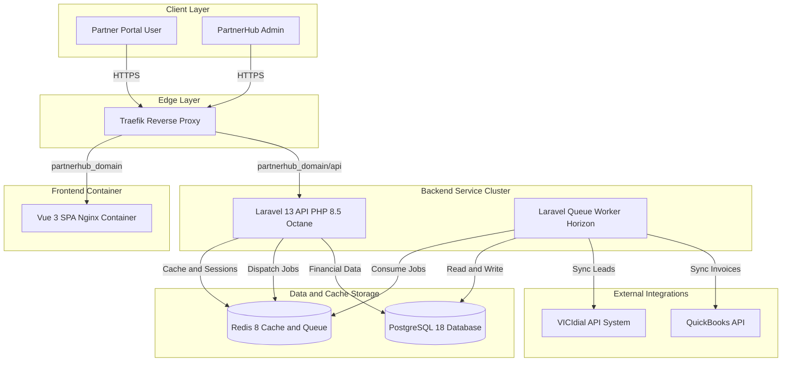
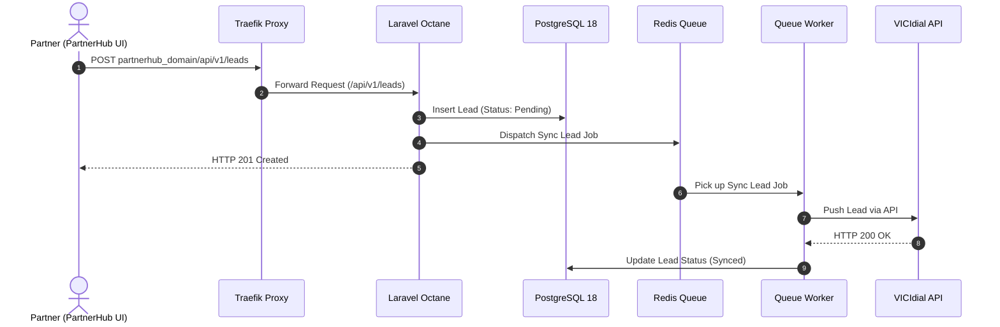
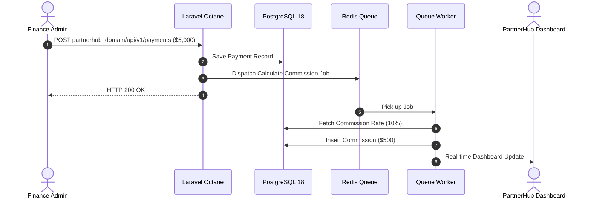
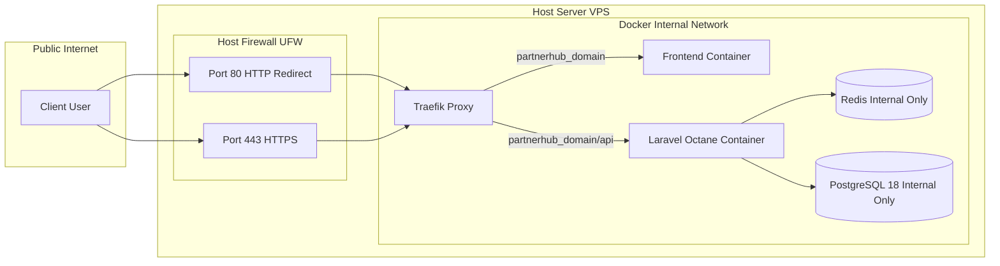

# System Architecture Specification: PartnerHub (Partner Management System)

## 1. Executive Summary

The **PartnerHub** platform is a modern, decoupled, high-performance **Partner Management System** built on a containerized micro-service architecture. It provides a secure, real-time, SaaS-like dashboard for partners to monitor leads, commissions, and payout histories, while offering platform administrators tools for cash-received tracking and financial auditing.

### Key Architectural Principles
- **Container-First Infrastructure**: All application components run as isolated, reproducible Docker containers orchestrated behind a dynamic reverse proxy.
- **High Concurrency & Low Latency**: Powered by Laravel 13 running on PHP 8.5 via **Laravel Octane** with **RoadRunner** high-performance application server.
- **Decoupled System Architecture**: Complete separation from legacy telephone marker systems (VICIdial), ensuring strict fault isolation, independent scaling, and zero impact on core telecommunication services.
- **Asynchronous Task Processing**: Heavy operations (commission calculations, third-party API sync, lead dispatch) are offloaded to asynchronous queue workers managed via Redis.
- **Single Domain Path Routing**: Unified routing under `partnerhub_domain` for frontend web assets and `partnerhub_domain/api` for backend REST services.

---

## 2. Technology Stack & Container Topology

| Layer / Service | Technology | Version | Base Container / Role |
| :--- | :--- | :--- | :--- |
| **Edge & Proxy** | Traefik | `v3.x` | Edge Reverse Proxy, TLS Termination, ACME/Let's Encrypt, Path-based Routing |
| **Frontend Application** | Vue 3 + Tailwind CSS | `Vue 3.x / Tailwind v4` | SPA (Single Page Application), Nginx static container (`partnerhub_domain`) |
| **Backend API Service** | Laravel 13 + PHP 8.5 | `PHP 8.5` | RESTful API Service, Business Logic Engine (`partnerhub_domain/api`) |
| **Application Server** | Laravel Octane + RoadRunner | `Octane v2.x` | In-memory HTTP Server with worker process pools |
| **In-Memory Cache & Queue** | Redis | `7.x / 8.x` | Session Storage, Response Cache, Queue Broker (Laravel Horizon) |
| **Primary Database** | PostgreSQL | `18` | ACID-compliant Relational Storage, Financial & Audit Logs |
| **Hosting Environment** | VPS / Cloud | N/A | Linux VPS (DigitalOcean Droplet, AWS EC2, Hetzner, etc.) |

---

## 3. High-Level Architecture Diagram

---

## 4. Key Workflows & Data Flow Sequences

### A. Lead Registration & Async Sync with VICIdial

1. A partner submits a lead through the PartnerHub Vue 3 frontend (`partnerhub_domain`).
2. Request is routed via Traefik to the backend API (`partnerhub_domain/api/v1/leads`).
3. Laravel Octane processes the request in-memory within milliseconds and writes the lead to PostgreSQL with a `Pending` status.
4. An asynchronous sync job is dispatched to Redis.
5. The background queue worker consumes the job, calls the VICIdial API, and updates the status to `Synced` upon success.

### B. Cash Received & Commission Calculation Engine

Commissions are calculated **strictly on actual cash received**, not billed amounts.

---

## 5. Network & Security Topology

### Security Measures:
- **Port Exposure**: Only Ports 80 and 443 are exposed on the host machine. PostgreSQL (5432) and Redis (6379) are kept entirely inside the isolated internal Docker bridge network.
- **Automated SSL/TLS**: Traefik automatically issues and manages Let's Encrypt SSL certificates for `partnerhub_domain`.
- **Audit Logging**: All financial edits (payments, manual adjustments, payouts) generate immutable audit records in PostgreSQL.

---

## 6. Containerization & Deployment Specifications

### Docker Services Breakdown (`docker-compose.yml` Structure)

1. `traefik`:
   - Image: `traefik:v3.1`
   - Handles SSL termination and path-based routing:
     - Host `partnerhub_domain` -> `frontend` container (Vue 3 SPA).
     - Host `partnerhub_domain` with PathPrefix `/api` -> `backend` container (Laravel 13 API).
2. `frontend`:
   - Image: `nginx:alpine`
   - Serves pre-compiled Vue 3 + Tailwind CSS static assets.
3. `backend`:
   - Image: `custom-php8.5-octane:latest`
   - Runs `php artisan octane:start --server=roadrunner --host=0.0.0.0 --port=8000`.
4. `queue-worker`:
   - Image: `custom-php8.5-octane:latest`
   - Runs `php artisan horizon` or `php artisan queue:work redis`.
5. `redis`:
   - Image: `redis:7.4-alpine`
   - Persistent volume attached for AOF cache/queue durability.
6. `database`:
   - Image: `postgres:18-alpine`
   - Dedicated Docker volume for data persistence and snapshot backups.

---

## 7. Scalability & Future Roadmap

- **Vertical Scaling**: Host can easily scale CPU/RAM on standard cloud providers (DigitalOcean, Hetzner, AWS).
- **Horizontal Scaling**: Backend API containers can be replicated (`docker compose scale backend=3`) behind Traefik load balancer due to stateless design enabled by Octane and Redis session storage.
- **Accounting Integration**: Easy addition of a dedicated QuickBooks worker container or queue job without changing core application architecture.
