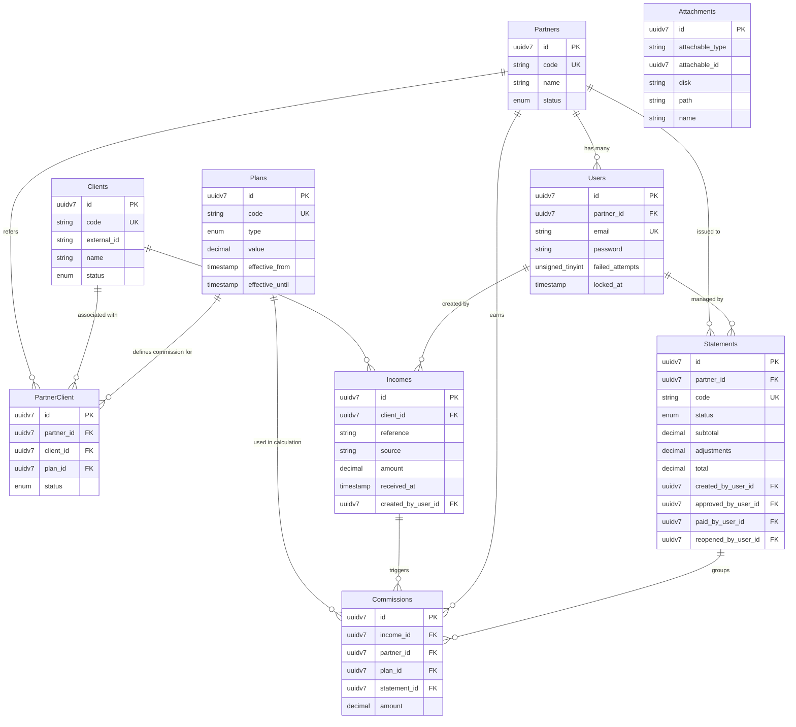

# Database Schema Specification: PartnerHub

## 1. Overview

The **PartnerHub** database is designed for PostgreSQL 18, leveraging time-ordered UUIDv7 for primary keys to optimize index locality and insert performance. The schema enforces strict referential integrity, financial auditability, soft deletes across all core tables, and polymorphic file attachment capabilities.

---

## 2. Entity-Relationship Diagram (ERD)

---

## 3. Detailed Entity Dictionary

### 3.1 `partners`
Represents the commercial entity (agency, affiliate, referral partner) eligible to earn commissions.

| Column | Data Type | Nullable | Attributes / Constraints | Description |
| :--- | :--- | :--- | :--- | :--- |
| `id` | `uuidv7` | No | Primary Key | Time-sorted UUIDv7 identifier |
| `code` | `varchar(50)` | No | Unique | Human-readable partner code (e.g. `PTR-001`) |
| `name` | `varchar(255)` | No | | Official commercial or corporate name |
| `status` | `varchar(20)` | No | Default: `'active'` | Status: `active`, `inactive` |
| `created_at` | `timestamp` | No | | Record creation timestamp |
| `updated_at` | `timestamp` | No | | Record update timestamp |
| `deleted_at` | `timestamp` | Yes | Soft Delete | Record deletion timestamp |

---

### 3.2 `users`
Accounts for system administrators and partner portal users sharing a unified authentication engine.

| Column | Data Type | Nullable | Attributes / Constraints | Description |
| :--- | :--- | :--- | :--- | :--- |
| `id` | `uuidv7` | No | Primary Key | Time-sorted UUIDv7 identifier |
| `partner_id` | `uuidv7` | Yes | Foreign Key -> `partners(id)` | Null for internal admins, populated for partner users |
| `name` | `varchar(255)` | No | | Full name of the user |
| `email` | `varchar(255)` | No | Unique | Authentication email address |
| `password` | `varchar(255)` | No | | Hashed password (Bcrypt / Argon2) |
| `photo` | `varchar(500)` | Yes | | Profile avatar URL or file path |
| `change_password_required` | `boolean` | No | Default: `false` | Flag indicating mandatory password update |
| `locked_at` | `timestamp` | Yes | | Timestamp when account was locked due to failed logins |
| `failed_attempts` | `smallint` | No | Default: `0` | Consecutive failed login attempt counter |
| `last_failed_at` | `timestamp` | Yes | | Timestamp of the last failed login attempt |
| `last_login_at` | `timestamp` | Yes | | Timestamp of the last successful authentication |
| `last_login_ip` | `varchar(45)` | Yes | | IP address of last login |
| `last_login_user_agent` | `varchar(500)`| Yes | | User agent string of last login |
| `created_at` | `timestamp` | No | | Record creation timestamp |
| `updated_at` | `timestamp` | No | | Record update timestamp |
| `deleted_at` | `timestamp` | Yes | Soft Delete | Record deletion timestamp |

---

### 3.3 `clients`
Clients referred by partners or synchronized from external platforms.

| Column | Data Type | Nullable | Attributes / Constraints | Description |
| :--- | :--- | :--- | :--- | :--- |
| `id` | `uuidv7` | No | Primary Key | Time-sorted UUIDv7 identifier |
| `external_id` | `varchar(100)` | Yes | Index | ID from VICIdial, CRM, or external accounting system |
| `code` | `varchar(50)` | No | Unique | Human-readable client code (e.g. `CLI-1002`) |
| `name` | `varchar(255)` | No | | Client company or account name |
| `contact_name` | `varchar(255)` | Yes | | Primary contact person |
| `email` | `varchar(255)` | Yes | | Contact email address |
| `phone` | `varchar(50)` | Yes | | Contact phone number |
| `status` | `varchar(20)` | No | Default: `'prospect'` | Status: `prospect`, `active`, `inactive`, `cancelled` |
| `created_at` | `timestamp` | No | | Record creation timestamp |
| `updated_at` | `timestamp` | No | | Record update timestamp |
| `deleted_at` | `timestamp` | Yes | Soft Delete | Record deletion timestamp |

---

### 3.4 `plans`
Immutable commission structure definitions. Plans are never edited in-place; new versions are created as active.

| Column | Data Type | Nullable | Attributes / Constraints | Description |
| :--- | :--- | :--- | :--- | :--- |
| `id` | `uuidv7` | No | Primary Key | Time-sorted UUIDv7 identifier |
| `code` | `varchar(50)` | No | Unique | Plan code (e.g. `PLAN-10PCT`, `FIXED-500`) |
| `description` | `text` | Yes | | Detailed explanation of calculation rules |
| `type` | `varchar(20)` | No | | Calculation type: `percentage`, `fixed` |
| `value` | `decimal(12,2)` | No | | Numerical value (e.g. `10.00` for 10% or `50.00` for $50) |
| `effective_from` | `timestamp` | No | | Start date of plan validity |
| `effective_until` | `timestamp` | Yes | | End date of plan validity (null = indefinitely active) |
| `created_at` | `timestamp` | No | | Record creation timestamp |
| `updated_at` | `timestamp` | No | | Record update timestamp |
| `deleted_at` | `timestamp` | Yes | Soft Delete | Record deletion timestamp |

---

### 3.5 `partner_client`
Pivot table establishing the commercial relationship between partners and clients, binding a specific commission plan.

| Column | Data Type | Nullable | Attributes / Constraints | Description |
| :--- | :--- | :--- | :--- | :--- |
| `id` | `uuidv7` | No | Primary Key | Time-sorted UUIDv7 identifier |
| `partner_id` | `uuidv7` | No | Foreign Key -> `partners(id)` | The partner making the referral |
| `client_id` | `uuidv7` | No | Foreign Key -> `clients(id)` | The referred client |
| `plan_id` | `uuidv7` | Yes | Foreign Key -> `plans(id)` | Specific commission plan assigned to this relationship |
| `referred_at` | `timestamp` | No | Default: `NOW()` | Timestamp when referral was submitted |
| `relationship_started_at`| `timestamp`| Yes | | Timestamp when client became active |
| `relationship_ended_at` | `timestamp`| Yes | | Timestamp when relationship ended |
| `status` | `varchar(20)` | No | Default: `'prospect'` | Relationship status: `prospect`, `active`, `inactive`, `cancelled` |
| `notes` | `text` | Yes | | Operational notes |
| `created_at` | `timestamp` | No | | Record creation timestamp |
| `updated_at` | `timestamp` | No | | Record update timestamp |
| `deleted_at` | `timestamp` | Yes | Soft Delete | Record deletion timestamp |

---

### 3.6 `incomes`
Represents verified cash received from a client (not invoices or accounts receivable).

| Column | Data Type | Nullable | Attributes / Constraints | Description |
| :--- | :--- | :--- | :--- | :--- |
| `id` | `uuidv7` | No | Primary Key | Time-sorted UUIDv7 identifier |
| `client_id` | `uuidv7` | No | Foreign Key -> `clients(id)` | Client who made the payment |
| `reference` | `varchar(100)` | No | Index | Bank transaction ID, check number, or QuickBooks ID |
| `source` | `varchar(50)` | No | Default: `'manual'` | Ingestion origin: `manual`, `quickbooks`, `stripe`, etc. |
| `received_at` | `timestamp` | No | | Exact date and time cash was received |
| `amount` | `decimal(12,2)` | No | Check > 0 | Net cash amount received |
| `notes` | `text` | Yes | | Internal audit or accounting comments |
| `created_by_user_id` | `uuidv7` | Yes | Foreign Key -> `users(id)` | User who recorded the payment |
| `created_at` | `timestamp` | No | | Record creation timestamp |
| `updated_at` | `timestamp` | No | | Record update timestamp |
| `deleted_at` | `timestamp` | Yes | Soft Delete | Record deletion timestamp |

---

### 3.7 `statements`
Settlement receipts grouping generated partner commissions into a payment cycle.

| Column | Data Type | Nullable | Attributes / Constraints | Description |
| :--- | :--- | :--- | :--- | :--- |
| `id` | `uuidv7` | No | Primary Key | Time-sorted UUIDv7 identifier |
| `partner_id` | `uuidv7` | No | Foreign Key -> `partners(id)` | Partner receiving the settlement |
| `code` | `varchar(50)` | No | Unique | Statement number (e.g. `STMT-2026-001`) |
| `title` | `varchar(255)` | No | | Descriptive title (e.g. `Q3 2026 Partner Settlement`) |
| `period_start` | `timestamp` | No | | Start date of settlement period |
| `period_end` | `timestamp` | No | | End date of settlement period |
| `status` | `varchar(20)` | No | Default: `'draft'` | Lifecycle: `draft`, `reopened`, `approved`, `paid` |
| `subtotal` | `decimal(12,2)` | No | Default: `0.00` | Sum of commissions included in statement |
| `adjustments` | `decimal(12,2)` | No | Default: `0.00` | Manual balance adjustments (bonuses, deductions) |
| `total` | `decimal(12,2)` | No | Default: `0.00` | Net total payable (`subtotal + adjustments`) |
| `created_by_user_id` | `uuidv7` | No | Foreign Key -> `users(id)` | User who drafted the statement |
| `approved_by_user_id`| `uuidv7` | Yes | Foreign Key -> `users(id)` | Admin who approved the statement |
| `paid_by_user_id` | `uuidv7` | Yes | Foreign Key -> `users(id)` | Admin who marked statement as paid |
| `reopened_by_user_id`| `uuidv7` | Yes | Foreign Key -> `users(id)` | Admin who reopened a paid statement |
| `created_at` | `timestamp` | No | | Record creation timestamp |
| `updated_at` | `timestamp` | No | | Record update timestamp |
| `deleted_at` | `timestamp` | Yes | Soft Delete | Record deletion timestamp |

---

### 3.8 `commissions`
System-calculated commission line items derived from valid `incomes`.

| Column | Data Type | Nullable | Attributes / Constraints | Description |
| :--- | :--- | :--- | :--- | :--- |
| `id` | `uuidv7` | No | Primary Key | Time-sorted UUIDv7 identifier |
| `income_id` | `uuidv7` | No | Foreign Key -> `incomes(id)` | Source cash income record |
| `partner_id` | `uuidv7` | No | Foreign Key -> `partners(id)` | Beneficiary partner |
| `plan_id` | `uuidv7` | No | Foreign Key -> `plans(id)` | Plan used during calculation |
| `amount` | `decimal(12,2)` | No | | Calculated commission amount |
| `statement_id` | `uuidv7` | Yes | Foreign Key -> `statements(id)` | Settlement statement grouping this commission |
| `created_at` | `timestamp` | No | | Record creation timestamp |
| `updated_at` | `timestamp` | No | | Record update timestamp |
| `deleted_at` | `timestamp` | Yes | Soft Delete | Record deletion timestamp |

---

### 3.9 `attachments`
Polymorphic file attachment table supporting file uploads (receipts, contracts, payout slips) across all domain entities.

| Column | Data Type | Nullable | Attributes / Constraints | Description |
| :--- | :--- | :--- | :--- | :--- |
| `id` | `uuidv7` | No | Primary Key | Time-sorted UUIDv7 identifier |
| `attachable_type` | `varchar(255)`| No | Index | Target model class name (e.g. `App\Models\Statement`) |
| `attachable_id` | `uuidv7` | No | Index | Target model primary key |
| `disk` | `varchar(50)` | No | Default: `'s3'` | Storage disk driver (`s3`, `local`, `do_spaces`) |
| `path` | `varchar(500)` | No | | Storage path / file key |
| `name` | `varchar(255)` | No | | Original uploaded file name |
| `created_at` | `timestamp` | No | | Record creation timestamp |
| `updated_at` | `timestamp` | No | | Record update timestamp |
| `deleted_at` | `timestamp` | Yes | Soft Delete | Record deletion timestamp |
